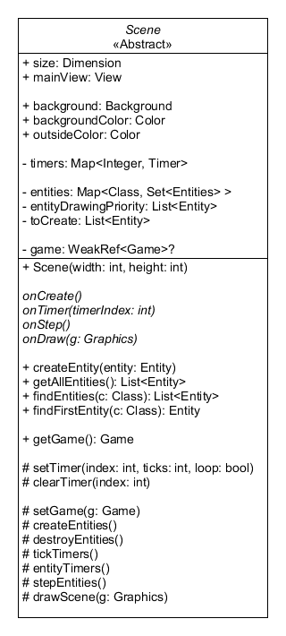
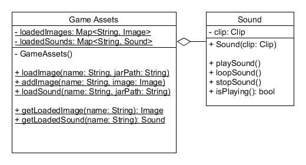
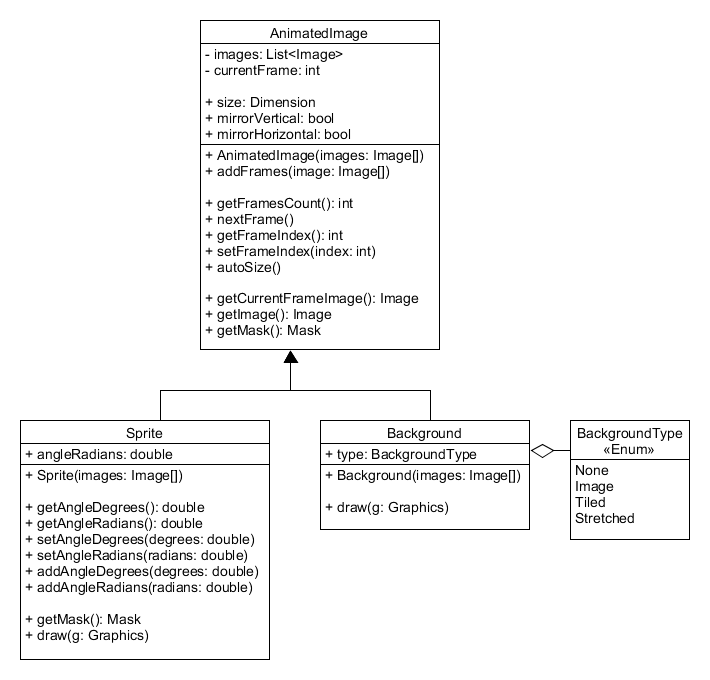

# CSCI-437 Fall 2020 - Game Engine

Game Engine

<br />

## Compiling and Running

Make sure you have `javac` version 8 or later installed on your computer.
Then, you can build the program using:

```
make
```

This will create an executable jar file named `Main.jar`.
In Windows, you can double-click on the file to run it. Otherwise, use

```
java -jar Main.jar
```

or

```
make run
```

You will need to have a display attached or the program will not be able to run.

If you need to rebuild the program from scratch, you can do:

```
make clean
make
```

<br />

## Game Engine Structure

The main structure of my game engine consists of 3 main classes:

- **Game** - Abstract data type for the entire game engine.
- **Scene** - "Room", "Location", or "Level" inside a game. Every game must start in a scene.
- **Entity** - Object that interacts in the game.

`Scene` and `Entity` are abstract classes that must be subclassed to fit the specific needs of your game.
They define several methods that need to be implemented:

- **onCreate()** - Called once when the entity or scene is first created
- **onDestroy()** - Called when an entity is destroyed. Not found on the scene class.
- **onTimer(timerIndex)** - Called when a timer is fired.
- **onStep()** - Called on every game tick.
- **onDraw(graphics)** - Add additional logic to the drawing code. Abstract in the scene, not abstract in the entity.

The general idea is that a scene creates the entities in the `onCreate()` method.
Then, the `onStep()` method in the entity handles things like keyboard events and collisions.
The `onTimer()` method is used for periodic events, like updating sprite animations or cutscenes.

There are also additional concrete classes to help with other aspects of the game:

- **AnimatedImage** - List of images that can also be transformed in several ways, like mirroring.
- **Sprite** - Subclass of `AnimatedImage` used by entities in the game. Sprites can be rotated and have improved collision detection.
- **Background** - Subclass of `AnimatedImage` used for the scene background image.
- **Mask** - Bounding box collision mask, used by entity. Has a relative offset and a rectangle size.
- **View** - Rectangular portion of the scene visible to the game.
- **GameAssets** - Singleton class for storing all game assets (images and sounds).
- **Sound** - Wrapper for the Java sound library, which is complicated to use by itself.
- **Helpers** - Utility class (like Math), cannot be instantiated. Has various generic helper functions.

<br />

## Game Class


The game object defines the abstract data type for the entire game engine.
The game stores a JFrame that is used to actually render the game, and encapsulates the JFrame complexities.
As such, all keyboard and mouse input comes from the Game object.
The class also defines some methods like `setTile()`, which changes the title string on the window.
Game has methods like `setFullscreen()` and `setWindowed()` to toggle between fullscreen mode and windowed mode.

One useful feature of the Game object is to store global game resources.
A resource is a wrapper for some sort of global state, such as a score counter.
You need to implement the `Resource` marker interface on a class to make it a valid resource.
Calling `setResource()` adds the resource into the game database, and `getResource()` retrieves it from the database.
There can only be one instance of each resource class in the game, as it uses the Java `class Class` to retrieve the resource.
For example:

```Java
class Score implements Resource {
  /* Class implementation */
}

Game game = /* Get Game */;
game.setResource(new Score());  /* Store into the database */

/* Other Code */

Score score = game.getResource(Score.class);  /* Retrieve from the database */
```

Each game always has one active scene. To change the active scene, you can call the `setScene()` method.
This will switch to the new scene after the current event handler has finished.

Finally, to run the game, simply call the `run()` method. This will open the JFrame and start the game.
The game will continue to run even if the main method exits.
To terminate the game and kill the program at any time, call the `end()` method, which simply closes the JFrame window.
After the game is running, all game events should be handled by the `Scene` and `Entity` components.

## Scene Class



The abstract scene class is the concept of a "level", "room" or "location" inside the game.
Each scene is linked with the parent game, so you can call `getGame()` to retrieve the main Game instance.
Do **NOT** call this method until after the `onCreate()` method has been called, or the game will be null.

Each scene has a size and also has a "view" into the scene. The view does not need to be the same size as the scene.
To create scrolling, you can move the view around in the scene.
You can set the outside color (background color shown outside the scene), background color (color shown inside the scene),
and background image of the scene.

Since the scene is an abstract class, you need to create a subclass of scene and implement the following methods:

- **onCreate()** - Called once when the scene is first created
- **onTimer(timerIndex)** - Called when a timer is fired
- **onStep()** - Called on every game tick
- **onDraw(graphics)** - Add additional logic to the drawing code

Each scene draws the game in the following order:

1. **Outside Color** - Color of the background when the view is outside the scene
2. **Background Color** - Color of the background inside the scene
3. **Background** - Background image of the scene
4. **Entities** - All entities inside the scene
5. **Scene `onDraw()` method** - Draw on top of everything else in the scene

The scene stores the list of entities inside the room indexed by the Java `class Class`.
This allows you to call `findEntities(class)` to search for all entities by a class.
You create a new entity with the `createEntity()` method, which will create the entity on the next event tick.
You can also get a list of all entities with the `getAllEntities()` method.
Since entities are created at a specific time in the event loop, the scene object uses a `toCreate` list to store
the entities that will be created on the next game tick.

The scene class has a built-in timer feature that can fire the `onTimer()` method after a given number of ticks.
To set a timer, use the `setTimer()` method. A timer can be a one-time event or a looped timer.
Each timer is indexed by an integer. Calling this method will replace any existing time left.
Use the `clearTimer()` method to stop a timer from firing.

The scene `onDraw()` method is the last thing drawn to the scene, so it has the highest drawing priority.
As such, it can be used to implement features like heads-up displays or a score counter.

## Entity Class


The entity class represents a game object inside the scene, like a "player" or an "enemy" object.
Each entity is linked with the parent scene, so you can call `getScene()` to retrieve the scene instance.
Do **NOT** call this method until after the `onCreate()` method has been called, or the scene will be null.

Since the entity is an abstract class, you need to create a subclass of entity and implement the following methods:

- **onCreate()** - Called once when the entity is first created
- **onDestroy()** - Called when an entity is destroyed
- **onTimer(timerIndex)** - Called when a timer is fired
- **onStep()** - Called on every game tick
- **onDraw(graphics)** - Add additional logic to the drawing code

Notice that the `onDraw()` method is not actually abstract. The default draw method draws the entity sprite at the current position.
If you do not want this behavior, you can override this method and implement your own drawing behavior.
However, if you still want the sprite to be drawn, you will need to call `super.onDraw()`.

By default, each entity has a position, sprite, and a mask. The position is the absolute `(x,y)` position of the object in the scene.
This is relative to `(0,0)` in the scene, not `(0,0)` of the view. This point is the **CENTER** of the entity, **NOT** the top left point.
The mask is the collision box of the entity, used for collision detection. The offset position of the mask is the **TOP LEFT** corner of the mask,
**NOT** the center of the entity. The sprite is the graph used for the entity. You can also use the `onVisible` flag to hide the entity
sprite and disable collision detection.

To implement entity animation, you need to periodically call the `sprite.nextFrame()` method. This can be done in a timer or the step function.
The default entity does **NOT** update the mask when you update the sprite, so your entity code will need to manually update the mask.
Typically, if the sprite does not change, you can set the mask in the `onCreate()` method and never need to change it.
Notice that sprite has a helper method called `getMask()` which computes the mask based on the sprite image size **AND** image rotation.
This may cause problems if your sprite is not mostly circular, as the rectangle of a rotated sprite will typically be much bigger than the original image.
If you want the mask to be smaller than the current image, you will need to compute the mask and offset manually.

Movement should be implemented using the Game keyboard and mouse methods.
You can get the game object by calling `this.getScene().getGame()`.
Checking for pressed keys should happen in the `onStep()` method so they occur during every game tick.

For collision detection, this should be handled by the `onStep()` method. Entities have a helpful method called `isCollidingWith()` that
use the entity mask for detecting collision. You can use the `findEntities()` method from the scene to get the list of all entities to check.
There is also a related method `isMouseInside()` that checks if the mouse pointer is currently inside the entity mask relative to the view.
This is useful for implementing buttons and entities that you can click on.

Like with the scele class, the entity class has a built-in timer feature that can fire the `onTimer()` method after a given number of ticks.
To set a timer, use the `setTimer()` method. A timer can be a one-time event or a looped timer.
Each timer is indexed by an integer. Calling this method will replace any existing time left.
Use the `clearTimer()` method to stop a timer from firing.

Entities can be destroyed by calling the `destroy()` method, which will cause the entity to be destroyed after the event handler finishes.
A destroyed entity no longer partipates in collision detection.
Since entities are destroyed at a specific time in the event loop, there is an `isDestroyed` flag used to indicate which entities should be destroyed.

## Game Assets



This class serves as a "database" for all image and sound files in your game. Sounds and images can be loaded by calling `loadImage()` and `loadSound()`.
Each image and sound should have an associated unique name. (_Though sounds can have the same names as images because they use different lookup tables._)
Then, you can call `getLoadedImage()` and `getLoadedSound()` to retrieve the files stored in memory.
All of these functions are static, so they can be called in any context in the game.

Since Java sounds are difficult to work with, the game engine uses a wrapper `Sound` class.
This can either play a sound once (`playSound()`) or play a sound looped until told to stop (`loopSound()`).
The `stopSound()` method stops the sound whether it is currently playing or not. Unfortunately, one of the limitations of Java sounds
is that each sound instance can only play one sound simultaneously. So while you can have multiple sounds at once (like an explosion and coin collected),
you cannot have the same sound playing simultaneously (two explosion sounds at once).
_I might try to fix this in a future version, but that is one of the game engine limitations for now._

## Animated Image Classes



The AnimatedImage class is a wrapper around a collection of images. It can be used to create animation and apply basic image transformations.
AnimatedImage has the following properties:

- **Size** - Used to scale the image
- **Mirror Vertical** - Flip the image vertically
- **Mirror Horizontal** - Flip the image horizontally

To load frames into the animated image, you can use the `addFrames()` method, which accepts a variable number of arguments.
You can go to the next frame by calling `nextFrame()`, which automatically loops around when the last image is reached.
Or, you can set the frame index manually using the `setFrameIndex()` method.
The `autoSize()` method sets the `size` parameter to the width and height of the first image in the list of frames.

This class has two main subclasses: Sprite and Background. Sprite should be used for entitiy graphics, and Background for the scene background.

Sprite has the following additional properties:

- **Angle Radians** - Rotation of the sprite in radians

Background has the following additional properties:

- **Background Type** - Modifies how to draw the background in the room

Supported background types include the following:

- **None** - Do not draw the background image
- **Image** - Simply draw the image starting at (0,0) in the scene
- **Tiled** - Repeatedly tile the background across the entire scene
- **Stretched** - Stretch the background and distort the image to fill the whole scene

AnimatedImage has a `getMask()` which computes the bounded box mask using the width and height of the image.
This method assumes that the entity position is in the **CENTER** of the image, **NOT** the top left corner of the image.
The Sprite class overrides this method to also compute the bounded box mask based on the image rotation.
If the image is not approximately circular, this can cause problems for collisions, so be careful with bounded boxes of rotated sprites.

## Animated Image Classes


View is a representation of a "viewport" into the scene. It has a position in the scene, relative to the top left corner (0,0) of the scene,
and a size for the view.

Mask is used for bounded box collision detection. It has a position relative to the **CENTER** of the entity, **NOT** the top left corner of
the entity, and a size for the rectangle. Mask also has useful helper methods `isCollidingWith()` and `isPointInside()` that can be used
if you want to implement custom collision detection logic.

<br />

## Event Loop

The game engine runs the following event loop during each game tick.
Ticks occur every 50 milliseconds, meaning the game runs at 20 FPS.
Every tick, the following actions occur in this order:

1. Possibly switch to a new scene and call the scene `onCreate()` method
2. Tick all timers in the current scene. If a timer fires, call the `onTimer()` handler for the scene.
3. Call the `onStep()` method for the scene.
4. Create all entities in the scene, and call the `onCreate()` method on each entity
5. Destroy any entities marked to be destroyed, and call the `onDestroy()` method on each entity
6. Tick all timers for all entities in the current scene. If a timer fires, call the `onTimer()` handler for that entity.
7. Call the `onStep()` method for all entities in the current scene.
8. Draw the scene

The scene is drawn in the following order:

1.  **Outside Color** - Color of the background when the view is outside the scene
2.  **Background Color** - Color of the background inside the scene
3.  **Background** - Background image of the scene
4.  **Entities** - All entities inside the scene
5.  **Scene `onDraw()` method** - Draw on top of everything else in the scene
